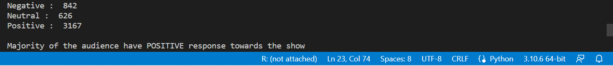
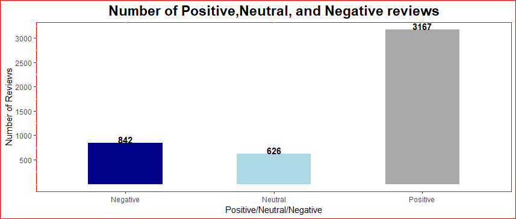
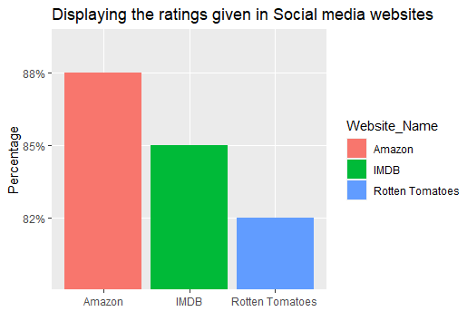
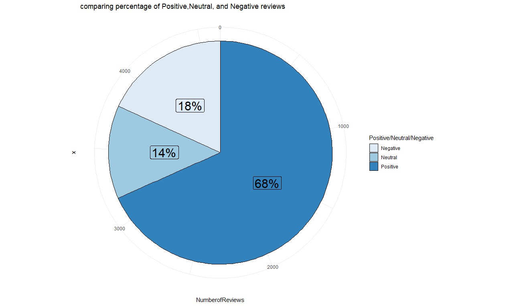

# Screenshots of Sentiment Analysis Result

# To display the number of negative, neutral and positive reviews

# Displays the Website in which audience gave more reviews

# to display the ratings given in Social media websites

# Comparision of ratings given in social media and sentiment analysis result

